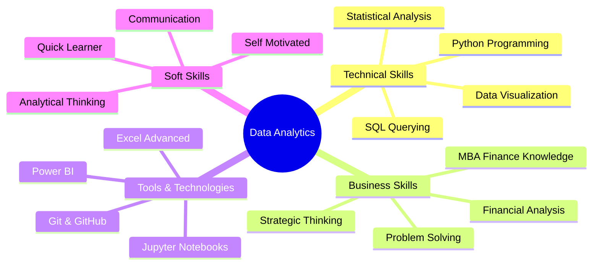

<!-- Header Banner -->
<div align="center">
  
</div>

<h1 align="center">👋 Hi there, I'm Manda Naga Venkata Sathya Sai Santosh!</h1>

<h3 align="center">🎯 Aspiring Data Analyst | 📊 Business Intelligence | 💼 MBA in Finance</h3>

<p align="center">
  <a href="https://linkedin.com/in/yourprofile" target="_blank">
    
  </a>
  <a href="mailto:your.email@example.com">
    
  </a>
  <a href="https://github.com/SaiSantosh79">
    
  </a>
</p>

---

## 🚀 About Me

```python
class DataAnalyst:
    def __init__(self):
        self.name = "Sai Santosh"
        self.education = {
            "mba": "Finance (MBA)",
            "engineering": "B.Tech - PSCMR College of Engineering"
        }
        self.role = "Aspiring Data Analyst"
        self.location = "Andhra Pradesh, India"
        self.current_focus = ["Data Analytics", "Business Intelligence", "Python"]
    
    def get_skills(self):
        return {
            "languages": ["Python", "SQL"],
            "libraries": ["Pandas", "NumPy", "Matplotlib", "Seaborn"],
            "tools": ["Power BI", "Excel", "Jupyter Notebook"],
            "domains": ["Financial Analysis", "Data Cleaning", "Predictive Analytics"]
        }
    
    def current_status(self):
        return "Open to Data Analyst opportunities 🎯"

# Initialize
me = DataAnalyst()
print(me.current_status())
```

<div align="center">
  
  
</div>

---

## 💼 Professional Journey

🎓 **MBA in Finance** - Combining business acumen with data-driven decision making  
🔧 **Engineering Background** - Strong analytical and problem-solving foundation  
📈 **Career Transition** - Actively building expertise in data analytics and business intelligence  
🌱 **Continuous Learner** - Self-taught in Python, SQL, and modern analytics tools

---

## 🛠️ Technical Skills

<div align="center">

### Programming & Query Languages
<p>
  
  
</p>

### Data Analysis & Visualization
<p>
  
  
  
  
</p>

### Business Intelligence Tools
<p>
  
  
  
</p>

### Domain Expertise
<p>
  
  
  
</p>

</div>

---

## 📊 What I'm Working On

<table>
  <tr>
    <td>🔍</td>
    <td><b>Data Cleaning & Preprocessing</b></td>
    <td>Mastering Pandas string operations and boolean indexing</td>
  </tr>
  <tr>
    <td>📈</td>
    <td><b>Predictive Analytics</b></td>
    <td>Building models for business forecasting</td>
  </tr>
  <tr>
    <td>💡</td>
    <td><b>Business Intelligence</b></td>
    <td>Creating interactive dashboards in Power BI</td>
  </tr>
  <tr>
    <td>🎯</td>
    <td><b>Portfolio Projects</b></td>
    <td>End-to-end analytics projects showcasing real-world skills</td>
  </tr>
</table>

---

## 🎯 Core Competencies



---

## 📚 Learning Resources I Use

<details>
<summary>📖 Click to expand my learning toolkit</summary>

### Online Platforms
- 🌐 **W3Schools** - Python & SQL fundamentals
- 🎥 **YouTube** - Data analytics tutorials and case studies
- 📖 **Documentation** - Pandas, NumPy official docs
- 🤖 **ChatGPT** - Code assistance and concept clarification

### Practice Areas
- Data manipulation with Pandas
- Text data cleaning techniques
- Boolean indexing and filtering
- Data visualization best practices
- SQL query optimization
- Power BI dashboard design

</details>

---

## 🌟 Featured Projects

<div align="center">

| Project | Description | Tech Stack |
|---------|-------------|------------|
| 📊 **Financial Analytics Dashboard** | Interactive Power BI dashboard analyzing financial metrics | Power BI, Excel |
| 🐍 **Python Data Cleaning Pipeline** | Automated data preprocessing workflow | Python, Pandas, NumPy |
| 💼 **Business Intelligence Case Study** | End-to-end analysis of business performance | SQL, Python, Power BI |
| 📈 **Predictive Analytics Model** | Forecasting model for business trends | Python, Scikit-learn |

</div>

*🚧 More projects coming soon! Check my repositories for latest work.*

---

## 📈 GitHub Activity

<div align="center">
  
</div>

<div align="center">
  
</div>

---

## 💡 Professional Goals

- 🎯 Secure a **Data Analyst** role in a growth-oriented organization
- 📊 Build a strong portfolio of **analytics projects**
- 🚀 Master advanced **predictive analytics** techniques
- 💼 Apply **MBA finance knowledge** to data-driven business solutions
- 🌐 Contribute to **open-source** data analytics projects
- 📚 Continuous learning and **skill development**

---

## 📫 Let's Connect!

<div align="center">

### 🤝 I'm always open to:

✅ Data Analyst opportunities  
✅ Collaborative projects  
✅ Learning discussions  
✅ Networking with data professionals  
✅ Mentorship and guidance  

<br/>

**💬 Feel free to reach out!**

<a href="mailto:your.email@example.com">
  
</a>
<a href="https://linkedin.com/in/yourprofile">
  
</a>

</div>

---

## 🎨 Profile Views & Support

<div align="center">
  


### ⭐ If you find my profile interesting, consider giving a star to my repositories!

</div>

---

<div align="center">
  
</div>

<!-- Last Updated: December 2025 -->
